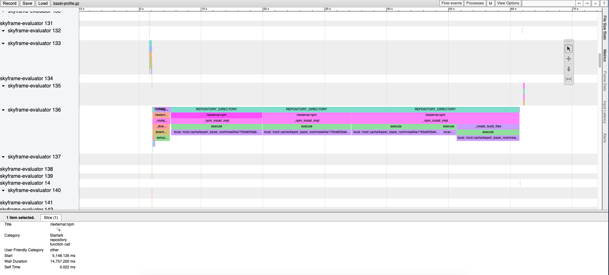

# Performance

- [Performance](#performance)
  - [Measuring performance with profiling](#measuring-performance-with-profiling)
    - [When analyzing these kind of profiles look for the following:](#when-analyzing-these-kind-of-profiles-look-for-the-following)

## Measuring performance with profiling

By Default bazel is generating a performance profile for each run that can be inspected with the Chrome tracing API.

The resulting file is located by default under `$(bazel info output_base)/command.profile.gz`. The location can be configured by passing `--profile=<path>` to the command.

The packed file can be uploaded to `chrome://tracing/` and then analyzed.

> Hint 💡
> When the information is to less verbose try running with `--record_full_profiler_data`.

### When analyzing these kind of profiles look for the following:

- **Slow analysis phase (RunAnalysisPhase)**, especially on incremental builds. This can be a sign of a poor rule implementation, for example one that flattens nested sets.
- **Individual slow actions**, especially those on the critical path. It might be possible to split large actions into multiple smaller actions or reduce the dependencies to speed them up.
- **Bottlenecks**, that is a small number of threads is busy while all others are idleing waiting for the result. Optimizing this will most likely require touching the rule implementations to introduce more parallelism.